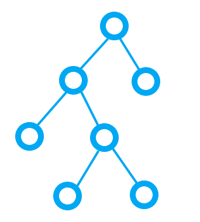

## 二叉树问题:
1. 有一个二叉树, 他的每个节点, 要么没有子节点, 要么有2个子节点如图

2. 该二叉树的每个节点都存在一个方法, fn, 会得到一个随机的正数或负数
3. 如果节点fn得到了正数, 则走向下左子节点, 否则走向向下右子节点
4. 直到该节点没有子节点, 该节点标记为 1, 其他没有子节点的节点标记为 0, 如下图

### 问题: 你设计一个方法, 能够得到最后的节点标记, 得到一个数组 类似于 [1, 0, 0, 0]
需要注意: 
1. 最终始终只有一个节点是1
2. 如果得到的数组类似于 `[0, 0, 1, 0, 0]` 则优化显示为 `[0, 1, 0, 0]`, 保证数组中 1 的前面至多包含一个 0

### 二叉树结构
- 你可以自己设计二叉树结构, 并做出最优解
- 也可以下载 index.html 和 problem.js, 是我创建好的二叉树结构, 可以直接在控制台查看和使用
